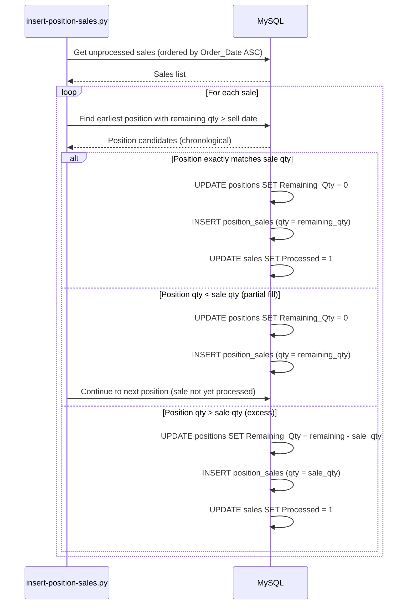

# Sequence Diagrams

## Full Data Flow

```mermaid
sequenceDiagram
    autonumber
    participant User
    participant Coinbase
    participant Importer
    participant DB as MySQL
    participant API as Flask
    participant Frontend as React

    User->>Importer: Run script (binance, coinbase)
    Importer->>Coinbase: Download CSV / read CSV file
    Coinbase-->>Importer: CSV data
    
    loop For each row in CSV
        Importer->>DB: Check if Order_Id + Transaction_Id exists
        DB-->>Importer: Row count
        alt Not found
            Importer->>DB: INSERT INTO transactions
        end
    end
    Importer->>DB: COMMIT

    User->>Importer: Run insert-positions.py
    Importer->>DB: SELECT DISTINCT coins with Spot Trading transactions
    DB-->>Importer: List of coins
    loop For each coin
        Importer->>DB: SELECT buy orders grouped by Order_Id
        DB-->>Importer: Order data
        loop For each order
            Importer->>DB: SELECT FROM positions WHERE Order_Id = ...
            DB-->>Importer: Row count
            alt Not found
                Importer->>DB: INSERT INTO positions
            end
        end
    end
    Importer->>DB: COMMIT

    User->>Importer: Run insert-sales.py
    Importer->>DB: SELECT DISTINCT coins with Spot Trading transactions
    DB-->>Importer: List of coins
    loop For each coin
        Importer->>DB: SELECT sell orders grouped by Order_Id and Source
        DB-->>Importer: Order data and fill time span
        alt Fills span more than 60 days
            Importer->>DB: SELECT individual sell fills for the order
            DB-->>Importer: Individual sale data
            loop For each fill
                Importer->>DB: SELECT FROM sales WHERE Order_Date + Order_Id match
                DB-->>Importer: Row count
                alt Not found
                    Importer->>Importer: Buffer individual sale record
                end
            end
        else Fills span 60 days or less
            Importer->>DB: SELECT FROM sales WHERE Order_Date + Order_Id match
            DB-->>Importer: Row count
            alt Not found
                Importer->>Importer: Buffer aggregated sale record
            end
        end
    end
    Importer->>DB: Bulk INSERT buffered sales
    Importer->>DB: COMMIT

    User->>Importer: Run insert-position-sales.py
    Importer->>DB: SELECT DISTINCT coins with sales
    DB-->>Importer: List of coins
    loop For each coin
        Importer->>DB: SELECT unprocessed sales (Processed = 0)
        DB-->>Importer: Sales list
        loop For each sale
            Importer->>DB: SELECT positions with Remaining_Qty > 0
            DB-->>Importer: Position candidates
            loop For each position (FIFO)
                Importer->>DB: UPDATE positions (Remaining_Qty)
                alt Sale fills position exactly
                    mark Sale as Processed
                    break
                else position exhausted
                    update Remaining_Qty = 0
                    continue to next position
                else position exceeds sale
                    update Remaining_Qty = carry_over
                    mark Sale as Processed
                    break
                end
            end
        end
    end
    Importer->>DB: COMMIT

    User->>Frontend: Browse app
    Frontend->>API: GET /coins
    API->>DB: SELECT Base_Asset FROM transactions (Spot Trading)
    DB-->>API: Coin list
    API-->>Frontend: JSON response

    Frontend->>API: GET /positions
    API->>DB: SELECT from positions WHERE Remaining_Qty > 0
    DB-->>API: Position data
    API-->>Frontend: JSON response

    Frontend->>API: GET /positions/{coin}
    API->>DB: SELECT from positions WHERE Coin = %s AND Remaining_Qty > 0
    DB-->>API: Coin positions
    API-->>Frontend: JSON response

    Frontend->>API: GET /sales/{year}
    API->>DB: SELECT FROM position_sales JOIN positions JOIN sales
    DB-->>API: Sales data for year
    API-->>Frontend: JSON response
```

## Position Matching Logic (FIFO)



## API Endpoints

| Endpoint | Method | Description | Query |
|---|---|---|---|
| `/` | GET | Health check | - |
| `/greet/<name>` | GET | Test endpoint | Path param: name |
| `/coins` | GET | List coins with activity | `SELECT Base_Asset FROM transactions WHERE Category = 'Spot Trading' GROUP BY Base_Asset` |
| `/positions` | GET | Current open positions | `SELECT * FROM positions WHERE Remaining_Qty > 0` |
| `/positions/<coin>` | GET | Positions for specific coin | `WHERE Coin = %s AND Remaining_Qty > 0` |
| `/sales/<year>` | GET | Sales for a given year | `position_sales JOIN positions JOIN sales WHERE YEAR(Order_Date) = %s` |
